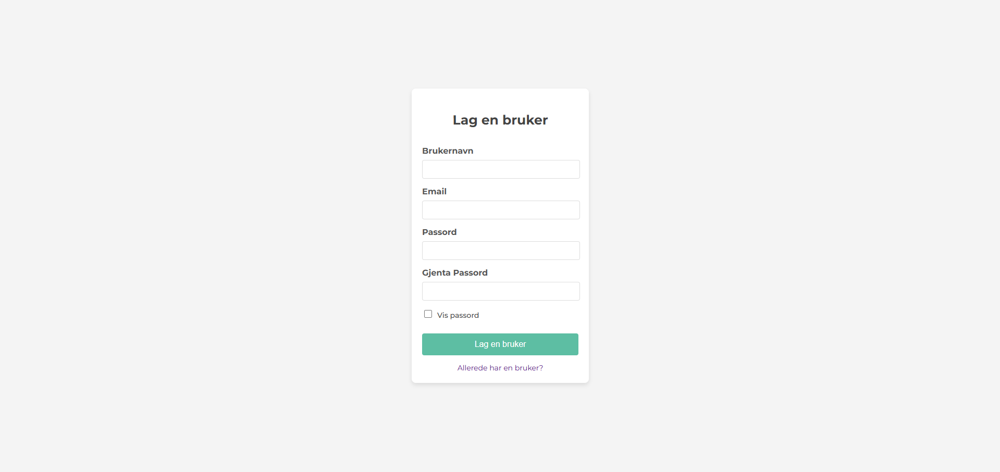
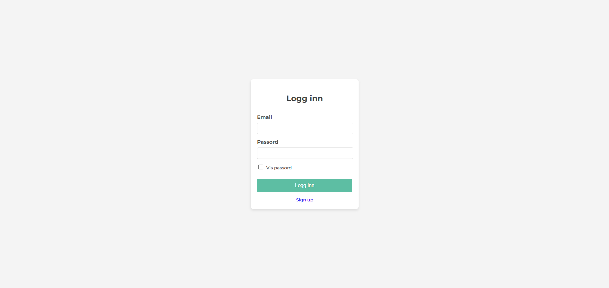
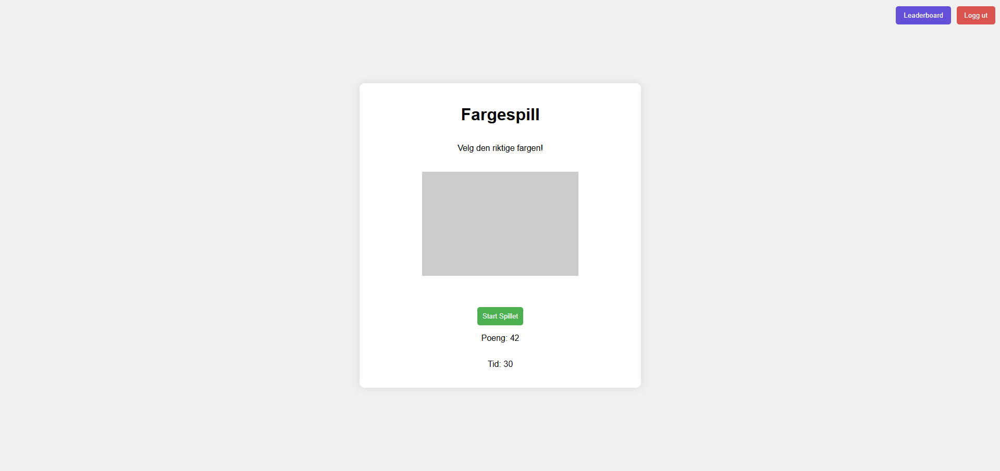
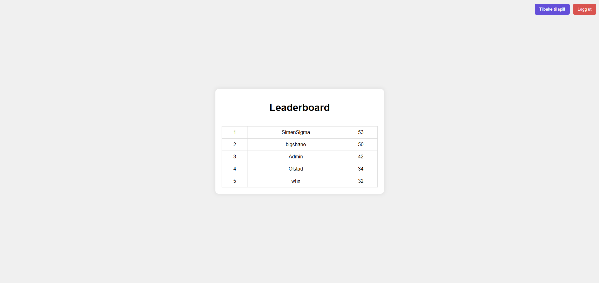

<h1 align="center">Color game</h1>

  <h3>
    <a href="https://santeriwille.github.io/FordypningsOppgave/">
      Lenken til prosjektet
    </a>
  </h3>

<!-- TABLE OF CONTENTS -->

## Table of Contents

- [Overview](#overview)
- [Built With](#built-with)
- [Features](#features)
- [How to use](#how-to-use)
- [Contact](#contact)

<!-- OVERVIEW -->
## Overview
Se nederst

### Built With
- [HTML](https://www.w3schools.com/html/)
- [CSS](https://www.w3schools.com/css/default.asp)
- [Javscript]
- [Firebase](https://firebase.google.com/docs/firestore)

## Features
- **Brukerautentisering:** Registrering og innlogging via Firebase Authentication.
- **Databaselagring:** Firebase Firestore lagrer brukernavn, e-post og poengsum.
- **Spillmekanikk:** Velg riktig farge innen 30 sekunder, få 1 poeng per riktig svar.
- **Leaderboard:** Viser de høyeste poengsummene og oppdateres automatisk.
- **Logout-knapp:** Tilgjengelig på både spill- og leaderboard-siden.

## How To Use
HTML:
- Brukes til å strukturere registreringssiden, innloggingssiden, selve spillet og leaderboarden.

CSS:
- Stiler nettsiden, gir fargene et klart og fint design.

JavaScript:
- Håndterer spilllogikken, inkludert tidsstyring, poengtelling og random farger.
- Kommuniserer med Firebase for å autentisere brukere og oppdatere databasen.

Firestore Database: 
- Lagrer brukernes e-post, brukernavn og høyeste poengsum.
- Henter og viser de beste poengsummene i leaderboardet.

## Future Plans
hvis vi hadde jobbet mer med dette så hadde vi sikkert laget flere spill og flere leaderboards til de spillene. 

## Contact
- Github [Santeri Wille](https://github.com/SanteriWille)
- Epost [Santeri Wille](mailto:santeriwille@gmail.com)

- Github [Andreas Ølstad](https://github.com/AndreasOlstad)
- Epost [Andreas Ølstad](mailto:andreasolstad2007@gmail.com)

## Happy coding!

## Forventet resultat

